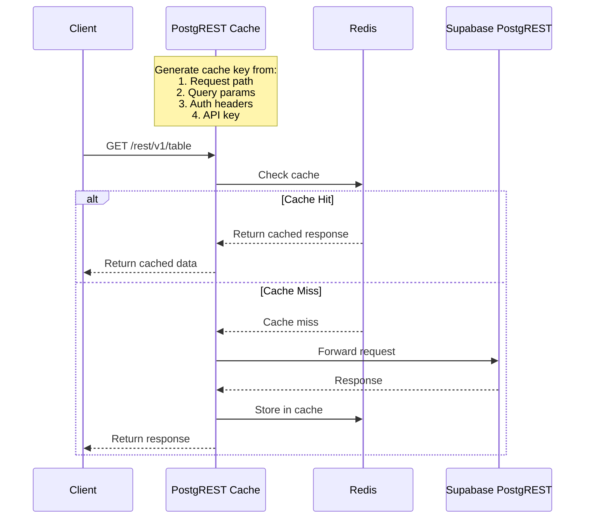

# PostgREST Cache for Supabase

A high-performance caching reverse proxy for Supabase's PostgREST API, using Redis for caching and Traefik for SSL termination. This solution provides a cost-effective alternative to Supabase's Custom Domains add-on while adding powerful caching capabilities.

> **Note**: This is currently an MVP (Minimum Viable Product). While fully functional, some advanced features are planned for future releases.

## Features

- 🚀 Redis-based caching for PostgREST responses
- 🔒 Free SSL/TLS certificates via Let's Encrypt
- 🎯 Selective table caching
- ⚡ High-performance Go implementation
- 🔄 Configurable cache TTL
- 🎛️ Load balancing support
- 🐳 Docker and Docker Compose ready

## Why Use This?

- **Cost-Effective**: Get custom domain support without paying for Supabase's Custom Domains add-on ($10/month)
- **Performance**: Reduce load on your database with Redis caching
- **Flexibility**: Cache specific tables or all tables based on your needs
- **Scalability**: Built-in support for multiple replicas and load balancing

## Technical Overview

### How It Works

The service acts as a caching reverse proxy between your clients and Supabase's PostgREST API. Here's how it processes requests:



### Cache Key Generation

The cache key is generated using the following components:
1. Request path (e.g., `/rest/v1/users`)
2. Query parameters (sorted alphabetically)
3. Authorization headers
4. API key
5. Content-Type and Accept headers

Example of how a cache key is constructed:

```go
// Internal cache key format
path|param1=value1|param2=value2|Authorization=Bearer...|ApiKey=your-key

// Final key is SHA-256 hashed with 'postgrest:' prefix
postgrest:hash_of_above_string
```

### Caching Rules

1. **Request Types**: Only GET requests are cached
2. **Path Filtering**: Only requests starting with `/rest/v1/` are considered for caching
3. **Table Selection**: Only configured tables are cached (controlled by CACHE_TABLES env var)
4. **Cache Duration**: Configurable via CACHE_TTL_MINUTES (default: 5 minutes)
5. **Response Storage**: Full response is cached including:
    - Response body
    - Status code
    - Headers

## Roadmap

Future improvements planned for this project include:

- 🔄 Intelligent cache invalidation system
- 🔍 Cache analytics and monitoring
- 🛠️ Advanced cache control headers support
- 🚦 Rate limiting capabilities
- 📊 Cache hit/miss metrics
- 🔐 Enhanced security features

## Prerequisites

- Docker and Docker Compose
- A domain name pointed to your server
- Supabase project

## Environment Variables

```env
# Traefik Configuration
TRAEFIK_EMAIL=your-email@example.com  # Email for Let's Encrypt
DOMAIN=api.yourdomain.com             # Your custom domain

# Application Configuration
SUPA_URL=https://your-project.supabase.co  # Your Supabase REST URL
REDIS_ADDR=redis:6379                      # Redis connection string
CACHE_TTL_MINUTES=5                        # Cache duration in minutes
CACHE_TABLES=table1,table2                 # Tables to cache (or * for all)
APP_REPLICAS=2                             # Number of application replicas
```

## Quick Start

1. Clone the repository:
   ```bash
   git clone https://github.com/Razikus/postgrest-cache-redis.git
   cd postgrest-cache-redis
   ```

2. Create a `.env` file with your configuration:
   ```env
   TRAEFIK_EMAIL=your-email@example.com
   DOMAIN=api.yourdomain.com
   SUPA_URL=https://your-project.supabase.co
   REDIS_ADDR=redis:6379
   CACHE_TTL_MINUTES=5
   CACHE_TABLES=*
   APP_REPLICAS=2
   ```

3. Start the services:
   ```bash
   docker-compose up -d
   ```

## Cache Configuration

### Table Selection
You can specify which tables to cache using the `CACHE_TABLES` environment variable:
- Use `*` to cache all tables
- Use comma-separated values to cache specific tables: `table1,table2,table3`

### Cache Duration
Set the cache TTL (Time To Live) using `CACHE_TTL_MINUTES`. Default is 5 minutes.

## Architecture

The system consists of three main components:
1. **Traefik**: Handles SSL termination and load balancing
2. **Redis**: Stores cached responses
3. **PostgREST Cache**: Go service that proxies requests to Supabase and manages caching

```
Client -> Traefik (SSL) -> PostgREST Cache -> Redis
                                          -> Supabase
```

## Caching Behavior

- Only GET requests are cached
- Cache keys are generated based on:
    - Request path
    - Query parameters
    - Authorization headers
    - API key
- Cache invalidation occurs automatically after TTL expiration

## Development

### Building Locally
```bash
go build -o postgrest-cache ./main/main.go
```

## Related Projects

Check out these other helpful Supabase-related projects:

- [Supabase NextJS Template](https://github.com/Razikus/supabase-nextjs-template) - Free template to kickstart your Supabase + Next.js project
- [Supanuggets](https://supanuggets.razikus.com) - Collection of mini apps for Supabase

## Connect With Me

- 🌐 Website: [razikus.com](https://www.razikus.com)
- 📦 GitHub Projects: [@Razikus](https://github.com/Razikus)
- 🛠️ Supanuggets: [supanuggets.razikus.com](https://supanuggets.razikus.com)

## License

This project is licensed under the Apache License 2.0 - see the [LICENSE](LICENSE) file for details.

## Contributing

Contributions are welcome! Please feel free to submit a Pull Request.

## Support

If you encounter any issues or have questions, please open an issue on GitHub.